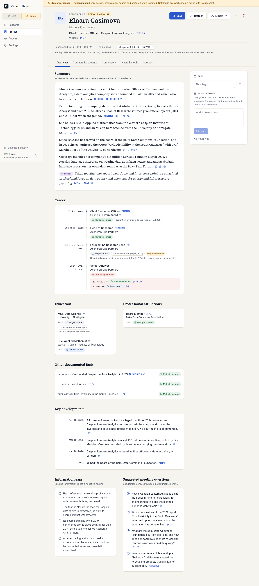

# PersonBrief

A private, single-owner workspace for preparing professional meetings. Enter a
person's name (optionally a company, country or known profile URL), confirm
which person you mean, and PersonBrief researches permitted public sources to
build an evidence-backed brief: career chronology, education, affiliations,
published business contacts, matched public profiles, documented professional
connections and news — every fact linked to the exact excerpt it came from.

It is research assistance, not a background check. It never scores
personality, trustworthiness, creditworthiness or hiring suitability, treats
missing information as neutral, and does not collect private, leaked or
guessed data.



## What works

| Area | Status |
| --- | --- |
| Search, identity selection (with "None of these — refine search" and documented auto-selection), research progress that survives refresh | Implemented, fixture- and browser-tested |
| Profile workspace: Overview, Contacts & accounts, Connections (list + graph), News & media, Sources; evidence drawer | Implemented, fixture- and browser-tested |
| Saved profiles, private notes, tags, deletion, refresh with "What changed?" | Implemented, fixture- and browser-tested |
| PDF brief and JSON export (notes excluded by default) | Implemented, tested in English, Azerbaijani and Russian |
| Interface in English, Azerbaijani and Russian; times stored in UTC, shown in the owner's time zone (default Asia/Baku) | Implemented, tested |
| Durable job runner (leases, fencing, heartbeats, checkpoints, retries, cancellation, stale-job handling) | Implemented, integration-tested |
| Fictional demo workspace and guest demo | Implemented, tested |
| Live research with Tavily + Anthropic | Implemented and unit-tested against the SDKs; **not live-tested** (no keys in the build environment) |
| Installable phone app (home screen, launch screens, offline screen, bottom sheets, share sheet) | Implemented, browser-tested on phone viewports |
| Hosted deployment | Render Blueprint and Docker configuration provided; **not deployed yet** (needs your Render account) |

See [docs/implementation-status.md](docs/implementation-status.md) for the
detailed status and [docs/decisions.md](docs/decisions.md) for the decision log.

## Requirements

- Node.js 22.12 or newer
- PostgreSQL 14 or newer
- For live research: a [Tavily](https://app.tavily.com) API key and an
  [Anthropic](https://console.anthropic.com) API key

## Quick start (local)

```bash
npm ci
cp .env.example .env.local          # set DATABASE_URL, BETTER_AUTH_SECRET, APP_URL
npm run db:migrate
OWNER_PASSWORD='choose-a-long-password' npm run owner:create -- --email you@example.com --name "Your Name"
npm run dev                         # web app on http://localhost:3000 + research worker
```

Sign in, switch to the **Demo** workspace and try one of the fictional
examples. Each one exercises a different situation (rich profile, Cyrillic
name, ambiguous name, sparse record, provider failure, profile-URL match).

Public sign-up is disabled. The owner is created from the command line, or once
through `/setup` when `OWNER_SETUP_TOKEN` is set and no owner exists yet.
Set `PUBLIC_DEMO_ENABLED=true` to let visitors open a temporary, fictional demo
workspace from the sign-in page; it can never reach live research and is
deleted after `DEMO_GUEST_TTL_HOURS`.

### Live research

Set `TAVILY_API_KEY` and `ANTHROPIC_API_KEY`, restart the web app and the
worker, and switch to the **Live** workspace. Settings shows which providers are
configured (never the values), the model (`ANTHROPIC_MODEL`, default
`claude-opus-5-5`) and the research budgets. Server budgets
(`RESEARCH_MAX_*`) are hard caps; the owner can only lower them. Usage and
estimated costs are recorded per run and labelled as estimates. A live
provider failure is reported as a failure or partial result — live research
never falls back to demo data.

## How it works

```
 Browser ──► Next.js app (pages, server actions, /api/jobs/:id polling, exports)
                │  writes a queued job, never calls providers itself
                ▼
           PostgreSQL ◄──► Research worker (npm run worker)
                            claims jobs (FOR UPDATE SKIP LOCKED), heartbeats,
                            checkpoints every step, fenced writes
```

Pipeline: normalise names (AZ/EN/RU variants) → discovery searches → candidate
identities → identity resolution (automatic only by a documented rule,
otherwise the owner chooses) → bounded search plan → read permitted pages →
structured extraction → **deterministic verification** (every excerpt must
appear verbatim in the retrieved text; contact values must appear on the page;
accounts need an explicit link from an identity-confirmed source; shared
employers become shared affiliations, never relationships; syndicated copies
count once; provider-reported dates are never used as publication dates) →
sourced summary (every sentence must cite verified claims or media) → atomic
snapshot save.

Retrieved text is treated as untrusted data in prompts. Model output is
constrained with structured outputs, re-validated with Zod and then checked
against the sources — a valid shape is not treated as truth.

## Tests

```bash
npm run lint
npm run typecheck
npm run test:unit                               # no database or network needed
npm run db:migrate:test && npm run test:integration   # uses TEST_DATABASE_URL (truncated!)
npm run fixtures:check                          # validates the fictional world
```

End-to-end (Playwright; uses a dedicated database whose research data is reset):

```bash
npm run build && npm run build:worker
DATABASE_URL=$E2E_DATABASE_URL APP_URL=http://localhost:3100 FIXTURE_LATENCY_MS=150 npm run e2e:serve &
E2E_DATABASE_URL=… npm run test:e2e             # also writes docs/screenshots/*
```

## Deployment

**Easiest: Render.** `render.yaml` describes the website, the research worker
and the database; Render → New → Blueprint creates all three. Follow
[docs/deploy-render.md](docs/deploy-render.md) — it is written step by step.

Elsewhere, the app needs a long-running Node process for the web app **and**
one for the worker, plus PostgreSQL. `docker compose up --build -d` runs all of
it; see [docs/deployment.md](docs/deployment.md) for hosting notes, HTTPS,
backups and the full list of settings. Serverless-only hosts can run the web
app, but the worker must run on a host that keeps a process alive.

## On your phone

PersonBrief is an installable web app: add it to the home screen (Safari →
Share → Add to Home Screen; Chrome → Install app) and it opens full-screen
with its own icon and launch screen. On phones the evidence opens as a bottom
sheet you can swipe away, nested screens have a back button, and PDFs can be
shared through the system share sheet. A small service worker keeps launches
fast and shows an offline screen; it stores only the app's own files, never
pages or research data.

## Project layout

```
src/app/                 routes (App Router), server actions, API routes
src/components/          UI (app shell, research, profile tabs, evidence drawer)
src/lib/research/        providers (Tavily, Anthropic, fixtures), prompts, pipeline, service
src/lib/jobs/            durable job store (claims, leases, fencing, checkpoints)
src/lib/{names,contacts,dates,evidence,media,diff,urls}/   deterministic rules
src/lib/export/          PDF and JSON exports
src/worker/              research worker process
src/fixtures/            fictional demo world (reserved .example domains, fictional numbers)
messages/                en, az, ru interface text
drizzle/                 SQL migrations
tests/{unit,integration,e2e}/
docs/                    status, decisions, deployment, screenshots
```

## Privacy and data use

Research data is private to the owner account and excluded from indexing.
Retrieved page text is kept for `SOURCE_CONTENT_RETENTION_DAYS` (default 14);
briefs keep only short supporting excerpts. Deleting a profile removes its
snapshots, sources, notes, tags, exports and the research runs behind it. The
in-app **Data use & privacy** page explains this in plain language, and every
profile has a **Report an issue** form for corrections.
